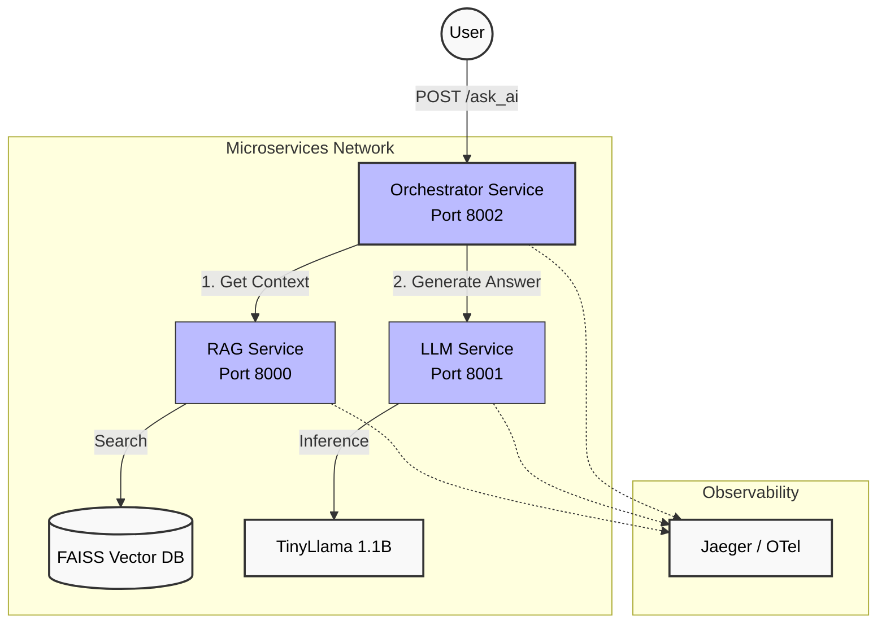

# 📖 RAG-LLM microservices

## 🚀 Overview

This repository hosts a production-ready **Retrieval-Augmented Generation (RAG)-LLM** pipeline implemented as a RESTful API using **FastAPI**. It is designed for high performance, reliability, and enterprise scalability, leveraging established Python libraries like PyTorch (CPU-only), HuggingFace Transformers, and FAISS components.

The core function is to allow users to submit queries against a pre-loaded knowledge base and retrieve contextually grounded answers, ensuring minimal hallucinations and providing verifiable sources.

### Key Files

* **`microservices/rag_app.py`**: Initialises the FastAPI application, loads the RAG pipeline (vector store and embeddings), and defines the secured `/ask` endpoint for context documents retrieval.
* **`microservices/llm_app.py`**: Initialises the LLM model (TinyLlama).
* **`microservices/rag_llm_app.py`**: Initialises the RAG-LLM orchestration for both RAG-based QnA.
* **`tests`**: Contains the unit tests for each of the microservices.
* **`docker-compose.yml`**: Contains the build instructions for each of the microservices, as well as initialises Jaeger for visualising OpenTelemetry (OTel) traces.
* **`Dockerfile`**: Based on a slim Python image, copies dependencies, installs packages (with the CPU-only PyTorch index), and sets the startup command.
* **`ci_cd_rag.yml`**: Includes critical steps like running unit tests, linting checks, and an **aggressive disk cleanup step** necessary for successfully building and saving large ML-based Docker images on GitHub Actions runners.

## ✨ Production-Grade Features

This codebase was developed with several key production-grade features and engineering considerations in mind:

| Feature | Implementation | Benefit |
| :--- | :--- | :--- |
| **Containerisation** | Includes `docker-compose.yml`, `Dockerfile`, and a CI/CD process to build and generate a portable Docker image artifact. | Guarantees environmental consistency across development, testing, and production (Dev/Test Parity). |
| **API Key security** | Implements a custom middleware/dependency to enforce authentication via an `X-API-Key` header. | Prevents unauthorised access and protects the underlying LLM/RAG resources. |
| **Dependency control** | Uses a dedicated `requirements.txt` and a strategic, explicit installation of **CPU-only PyTorch**. | Minimises image size (preventing CI disk space exhaustion) and ensures compatibility with non-GPU cloud/local environments. |
| **CI/CD validation** | GitHub Actions workflow (`ci_cd.yml`) enforces linting (`black`, `flake8`), unit testing (`pytest`), and successfully generates the deployment artifact. | Ensures code quality, functionality, and automated artifact generation on every push to `main`. |
| **Configuration** | Uses a `.env` file (or environment variables) for sensitive keys and configuration parameters (e.g., `API_KEY`, `OTEL_SERVICE_NAME`). | Decouples configuration from code for security and environment flexibility. |
| **Resilience patterns** | Circuit Breaker implementation on LLM calls. | Prevents cascading failures; if the LLM service is overloaded, the system fails fast and recovers gracefully. |

## System Architecture
User posts a query to the RAG-LLM orchestrator (port 8002) -> microservice calls RAG (8000) -> microservice calls LLM (8001) for question answering.

## 📈 Enterprise Scaling Considerations

This codebase lays the foundation for scaling in an enterprise environment.

| Scaling Aspect | Strategy / Required Changes |
| :--- | :--- |
| **High availability** | Deploy multiple instances of the Docker image behind a **Load Balancer** (e.g., AWS ALB, Nginx). |
| **Vector store** | Replace the current in-memory vector store (FAISS) with a persistent, distributed database like **Pinecone**, **Weaviate**, or **ChromaDB**. |
| **Request throughput** | Implement a task queue system (e.g., **Celery** with **Redis** or **RabbitMQ**) for asynchronous processing of long-running RAG queries, moving them out of the FastAPI worker thread. |
| **Observability** | Integrate distributed tracing (e.g., using **OpenTelemetry** or **LangSmith**) to monitor the performance of each RAG-LLM component (embedding, retrieval, generation) in production. |
| **Knowledge base updates** | Create a separate, scheduled CI/CD job to rebuild the vector store index nightly and push the updated index to S3 or a managed vector store. |

## 💻 Advanced Engineering Considerations
To ensure this RAG-LLM pipeline is truly production-grade, we applied the following architectural principles:

1. Telemetry (observability)

    **Purpose**: To monitor the health, performance, and behavior of the RAG pipeline in production.
    
    **Strategy**: Implement OpenTelemetry (OTel) instrumentation (for traces, metrics, and logs). This is critical for RAG to profile where latency occurs (e.g., is it the embedding model loading, the vector search, or the final LLM call?). Structured logging should be used to link error messages directly to specific request traces.

2. Lifespan on FastAPI

    **Purpose**: Efficiently manage application resources.
    
    **Strategy**: Use the lifespan parameter with an async context manager (`@asynccontextmanager`) instead of legacy startup/shutdown events.
    
    **Startup (before `yield`)**: Load expensive, shared resources once, such as the Sentence Transformer model and the FAISS Vector Store. This guarantees the resources are ready before the first request and shared across all workers.
    
    **Shutdown (after `yield`)**: Perform graceful cleanup, like closing database connections or releasing memory.

3. Sync vs. Async (The ML Concurrency Rule)

    **FastAPI's strength**: Asynchronous (async def) is ideal for I/O-Bound tasks (waiting for external APIs/DBs), allowing high concurrency.
    
    **AI/ML workload challenge**: Local RAG component execution (embedding generation, local LLM inference) is CPU-Bound (heavy computation).
    
    **Best practice**: The functions that execute the heavy ML inference should be defined as standard def functions. FastAPI automatically detects this and offloads the work to an internal thread pool, preventing the CPU-intensive task from blocking the main asynchronous event loop. This ensures the API remains responsive to new requests while computation is running.
