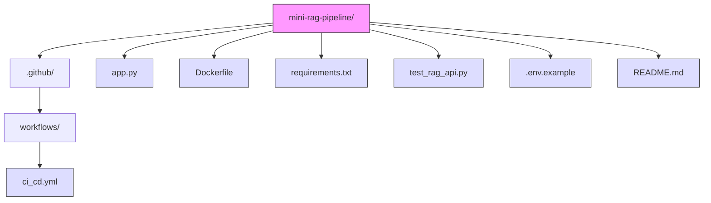
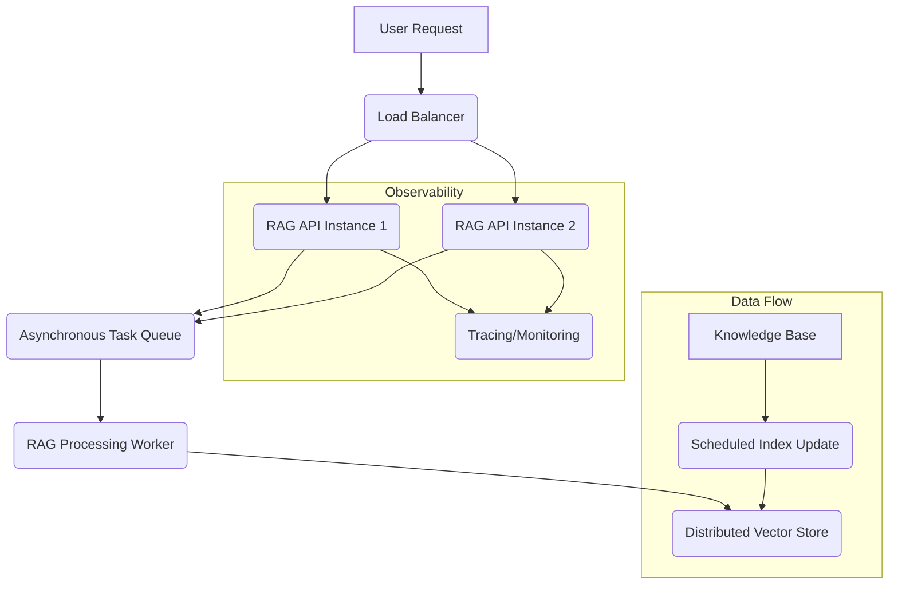

# 📖 Mini RAG Pipeline: Production-Grade Retrieval-Augmented Generation (RAG) API

[](https://github.com/EMarc2023/Mini_RAG_pipeline/actions/workflows/ci_cd_rag.yml/badge.svg)](https://github.com/EMarc2023/Mini_RAG_pipeline/actions/workflows/ci_cd_rag.yml))

## 🚀 Overview

This repository hosts a production-ready **Retrieval-Augmented Generation (RAG)** pipeline implemented as a RESTful API using **FastAPI**. It is designed for high performance, reliability, and enterprise scalability, leveraging established Python libraries like PyTorch (CPU-only), HuggingFace Transformers, and LangChain components.

The core function is to allow users to submit queries against a pre-loaded knowledge base and retrieve contextually grounded answers, ensuring minimal hallucinations and providing verifiable sources.

## 🏗️ Codebase Structure

The project follows a standard structure for FastAPI applications:



## ✨ Production-Grade Features

This codebase was developed with several key production-grade features and engineering considerations in mind:

| Feature | Implementation | Benefit |
| :--- | :--- | :--- |
| **Containerization** | Includes a robust `Dockerfile` and a CI/CD process to build and generate a portable Docker image artifact. | Guarantees environmental consistency across development, testing, and production (Dev/Test Parity). |
| **API Key Security** | Implements a custom middleware/dependency to enforce authentication via an `X-API-Key` header. | Prevents unauthorized access and protects the underlying LLM/RAG resources. |
| **Dependency Control** | Uses a dedicated `requirements.txt` and a strategic, explicit installation of **CPU-only PyTorch**. | Minimizes image size (preventing CI disk space exhaustion) and ensures compatibility with non-GPU cloud/local environments. |
| **CI/CD Validation** | GitHub Actions workflow (`ci_cd.yml`) enforces linting (`black`, `flake8`), unit testing (`pytest`), and successfully generates the deployment artifact. | Ensures code quality, functionality, and automated artifact generation on every push to `main`. |
| **Configuration** | Uses a `.env` file (or environment variables) for sensitive keys and configuration parameters (e.g., `API_KEY`, `OTEL_SERVICE_NAME`). | Decouples configuration from code for security and environment flexibility. |

### Key Files

* **`app.py`**: Initializes the FastAPI application, loads the RAG pipeline (vector store, embeddings, LLM), and defines the secured `/ask` endpoint.
* **`Dockerfile`**: Based on a slim Python image, copies dependencies, installs packages (with the CPU-only PyTorch index), and sets the startup command.
* **`ci_cd.yml`**: Includes critical steps like running unit tests, linting checks, and an **aggressive disk cleanup step** necessary for successfully building and saving large ML-based Docker images on GitHub Actions runners.

## ⚙️ Setup and Local Run (WSL/Linux)

### Prerequisites

* Python 3.10+
* Docker Desktop (if running containerized)
* `git`

### Environment Setup

1.  **Clone the repository:**
    ```bash
    git clone https://github.com/EMarc2023/Mini_RAG_pipeline.git
    cd mini-rag-pipeline
    ```
2.  **Create and fill `.env`:** Copy `.env.example` to `.env` and fill in your actual `API_KEY` and other necessary environment variables.
3.  **Install dependencies:**
    ```bash
    pip install -r requirements.txt
    ```

### Running the API Locally (WSL/Linux)

Run the API using Uvicorn, passing the environment variables:

```bash
# Set your actual API Key and run the server
API_KEY="SECRET_TEST_KEY_123" uvicorn app:app --host 0.0.0.0 --port 8000
```

### Testing the Endpoint

In a new terminal, verify the API is running correctly:

```bash
curl -X GET "http://localhost:8000/ask?query=What%20is%20FastAPI%3F" \
-H "X-API-Key: SECRET_TEST_KEY_123"
```

## 🐳 Dockerization and Deployment

The project is designed to be deployed via a Docker image artifact generated by the CI/CD pipeline.Artifact GenerationUpon a successful push to main, the CI/CD pipeline executes the docker-artifact job, which performs an aggressive disk cleanup, builds the Docker image (rag-api:v1), and uploads the compressed image file (rag-api-v1.tar) as an artifact.

Deployment Process (Using the Artifact) 
1. Download: Download the rag-api-v1.tar artifact from the GitHub Actions run summary.
2. Transfer: Copy the .tar file to your target production server.
3. Load: Load the image into the server's Docker registry:
   ```bash
   docker load -i rag-api-v1.tar
   ```
5. Run: Start the service, passing the production API key:Bashdocker run -d \
   ```bash
   --name rag-server-prod \
      -p 8000:8000 \
      -e API_KEY="YOUR_PRODUCTION_KEY" \
      rag-api:v1
   ```

## 📈 Enterprise Scaling Considerations

This codebase lays the foundation for scaling RAG in an enterprise environment.



| Scaling Aspect | Strategy / Required Changes |
| :--- | :--- |
| **High Availability** | Deploy multiple instances of the Docker image behind a **Load Balancer** (e.g., AWS ALB, Nginx). |
| **Vector Store** | Replace the current in-memory vector store (FAISS) with a persistent, distributed database like **Pinecone**, **Weaviate**, or **ChromaDB**. |
| **Request Throughput** | Implement a task queue system (e.g., **Celery** with **Redis** or **RabbitMQ**) for asynchronous processing of long-running RAG queries, moving them out of the FastAPI worker thread. |
| **Observability** | Integrate distributed tracing (e.g., using **OpenTelemetry** or **LangSmith**) to monitor the performance of each RAG component (embedding, retrieval, generation) in production. |
| **Knowledge Base Updates** | Create a separate, scheduled CI/CD job to rebuild the vector store index nightly and push the updated index to S3 or a managed vector store. |


## 💻 Advanced Engineering Considerations
To ensure this RAG pipeline is truly production-grade, we applied the following architectural principles:

1. Telemetry (Observability)
    Purpose: To monitor the health, performance, and behavior of the RAG pipeline in production.
    
    Strategy: Implement OpenTelemetry (OTel) instrumentation (for Traces, Metrics, and Logs). This is critical for RAG to profile where latency occurs (e.g., is it the embedding model loading, the vector search, or the final LLM call?). Structured logging should be used to link error messages directly to specific request traces.

2. Lifespan on FastAPI
    Purpose: Efficiently manage application resources.
    
    Strategy: Use the lifespan parameter with an async context manager (@asynccontextmanager) instead of legacy startup/shutdown events.
    
    Startup (Before yield): Load expensive, shared resources once, such as the Sentence Transformer model and the FAISS Vector Store. This guarantees the resources are ready before the first request and shared across all workers.
    
    Shutdown (After yield): Perform graceful cleanup, like closing database connections or releasing memory.

3. Sync vs. Async (The ML Concurrency Rule)
    FastAPI's Strength: Asynchronous (async def) is ideal for I/O-Bound tasks (waiting for external APIs/DBs), allowing high concurrency.
    
    ML's Challenge: Local RAG component execution (embedding generation, local LLM inference) is CPU-Bound (heavy computation).
    
    Best Practice: The functions that execute the heavy ML inference should be defined as standard def functions. FastAPI automatically detects this and offloads the work to an internal thread pool, preventing the CPU-intensive task from blocking the main asynchronous event loop. This ensures the API remains responsive to new requests while computation is running.
